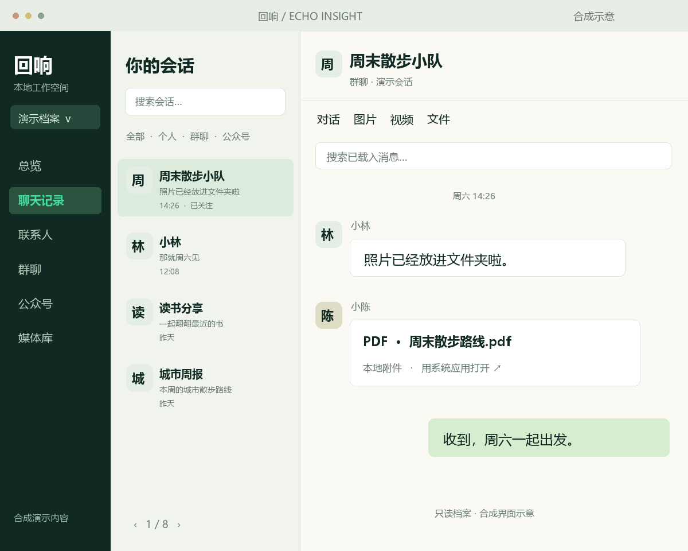

# 回响 / Echo Insight

**把微信里的聊天、照片和文件，整理成自己的本地档案。**

[官网](https://huixiang.nickszy.com) · [功能与范围](https://huixiang.nickszy.com/features.html) · [版本与下载](https://huixiang.nickszy.com/download.html) · [介绍视频](website/assets/echo-insight-intro.mp4) · [反馈](https://github.com/Nickszy/huixiang/issues)

微信用久了，留下的不只有消息，还有照片、讨论和分享过的资料。回响希望让这些内容在自己的电脑上更好浏览、查找和收藏。

## 先确认版本

| 范围 | 状态 |
| --- | --- |
| Windows 本机档案、聊天浏览与媒体库 | 本机研发验证中，尚未打包公开 |
| 公开 Windows 0.1.0 安装包 | 早期合成摘要演示版；未启用真实微信连接与新档案功能 |
| macOS 安装包与采集 | 尚未发布 |
| 真实聊天 AI 总结、跨群归纳与定时推送 | 尚未接入，属于后续方向 |

图片和视频均为**合成界面示意**，不含真实人物或聊天，也不是已发布安装包的录屏。

## 当前正在完善的档案体验

- **会话有秩序**：个人、群聊、公众号分开浏览；最近消息优先，支持分页、会话搜索、关注与关注筛选。
- **聊天有上下文**：滚动载入更早消息，搜索当前已载入内容；在会话内切换图片、视频与文件。
- **媒体好找**：媒体库搜索、翻页，按时间、大小、名称排序；音频、PDF、Word、Excel、PPT、压缩包等分类。
- **图片说清楚**：尝试解码微信 4.x 本机图片，优先选择原图候选；筛选原图文件存在、仅缩略图或缺失文件。是否可读取取决于本机文件、密钥与格式，部分格式需要 FFmpeg。
- **本机保存与刷新**：用户选择保存目录；应用打开时默认每 5 分钟检查变化，只重新处理变化的整库并替换结果，未变化库跳过。关闭应用后不检查。

数据库密钥加密保存在本机；解密后的数据库及图片缓存含明文私人内容，请保护相应目录。本机档案浏览不调用云端模型。完整说明见[隐私与边界](https://huixiang.nickszy.com/privacy.html)。

语音播放、表情资源、全档案全文搜索尚未接入；视频和文件的群聊/发送者关联仍需补全。文件缺失无法恢复；有原图文件也不保证可以解码。微信版本兼容性仍在验证，不承诺支持所有 4.x 版本。

## 公开下载：早期 0.1.0 演示版

适合了解合成群摘要、报告保存与引用回查。**下载此版本不会获得上方的新档案体验。** 当前模型配置只保存，不发起模型调用。

| 文件 | 大小 | SHA-256 |
| --- | --- | --- |
| [Windows x64 安装版](https://github.com/Nickszy/huixiang/releases/download/v0.1.0/echoinsight-0.1.0-windows-x64-setup.exe) | 9,372,053 字节 | `7ed6707bb12056e02807b33701c051f1cf3247fc83fa69529d993633f94b7aed` |
| [Windows x64 便携版](https://github.com/Nickszy/huixiang/releases/download/v0.1.0/echoinsight-0.1.0-windows-x64-portable.zip) | 14,317,166 字节 | `c2206536e010798490e69d59bd6317106be1ff5358186bfc4ce8b1fcf7dcfded` |

Windows 10 1809+ / Windows 11 x64，需要 WebView2。安装包未签名；请核对哈希并遵守系统安全提示。软件没有自动升级。新档案版本会另行打包、验证并公布版本与安装包哈希。

## 项目与素材

公开发布仓库保存官网源码、发布信息与推广素材；桌面应用源码尚未完整公开，不能通过克隆此发布仓库直接构建桌面客户端。

- [官网维护与发布](website/README.md)
- [小红书介绍稿](promotions/xiaohongshu.md)
- [产品视频分镜](promotions/video-script.md)
- [素材生成与归档](promotions/README.md)
- [Easel 参考记录](promotions/reference-easel.md)

内容组织参考 [ZJU-REAL/Easel](https://github.com/ZJU-REAL/Easel) 的项目化创作与素材归档方式；没有使用其代码或媒体，也没有合作或背书关系。回响是独立技术预览，非微信官方产品。
